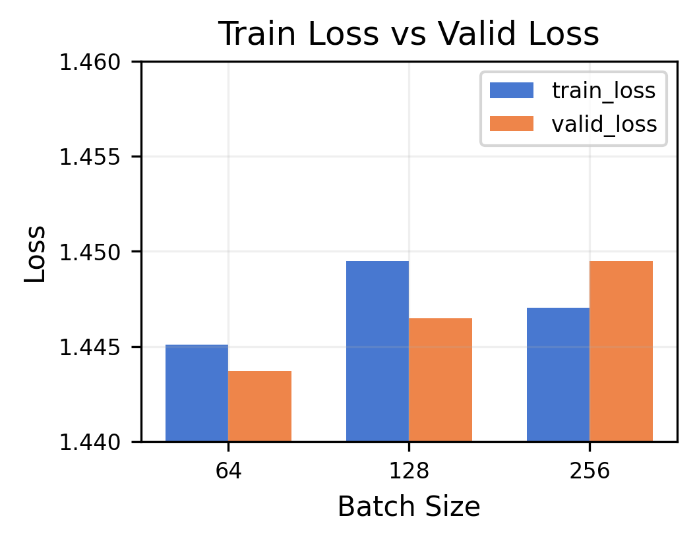
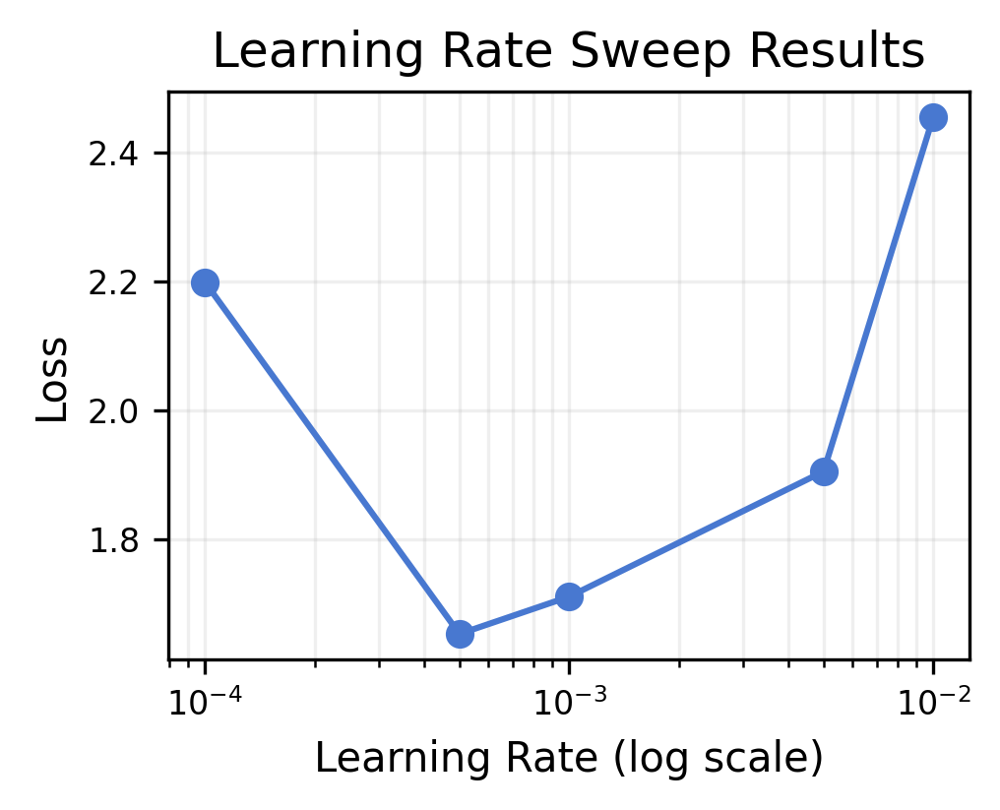
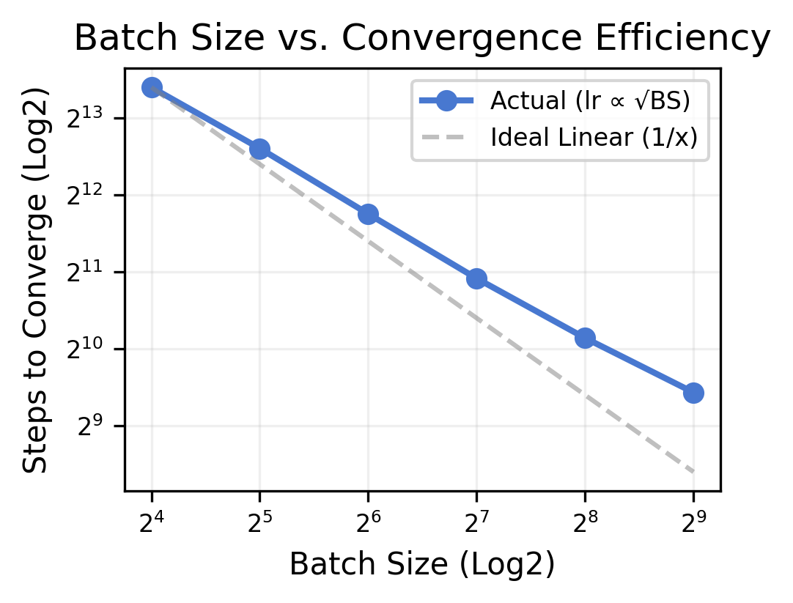

# CS336 Spring 2025 Assignment 1: Basics

- You can reproduce the results by running the scripts provided in the ./scripts directory.
- The current implementation supports the TinyStories dataset. If you wish to use OpenWebText, please update the configuration and training scripts accordingly.

## Results

| Split | TinyStories |
| :--- | ---: |
| **Train Loss** | 1.445 |
| **Valid Loss** | 1.444 |

> Train loss was measured as the EMA of the final steps with $\beta=0.9$, while validation loss was calculated as the overall average.

## Ablation Results

   
   
   
   
  

